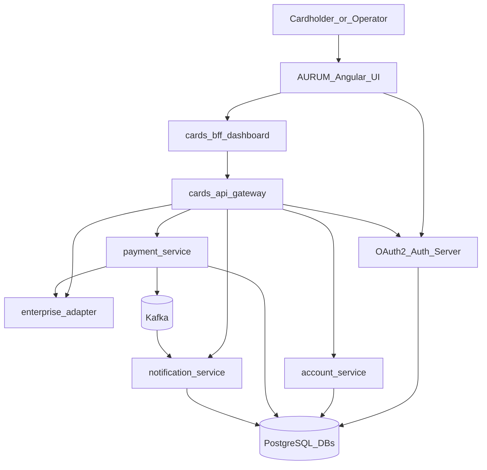
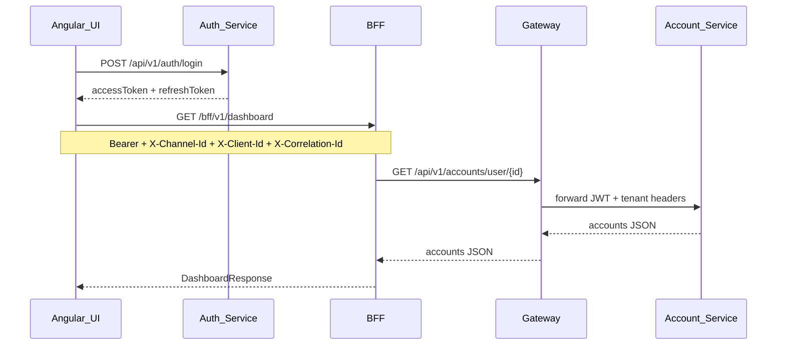
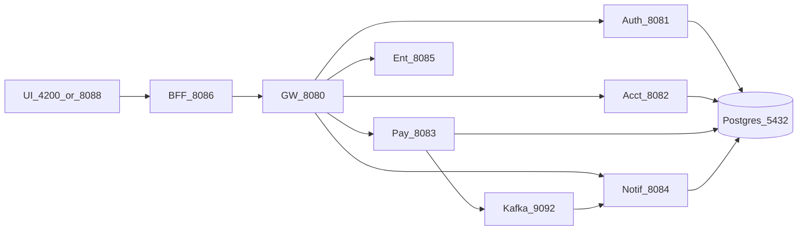

# System Design — Development Architecture

Interview-ready view of how the platform is shaped in local/dev.

## Context (C4 Level 1)

## Request path (happy path)

## Bounded contexts

| Context | Service | Owns |
|---------|---------|------|
| Identity | authentication | Users, roles, OAuth2 tokens, refresh tokens |
| Account | account-details | Profiles, cards, transaction history |
| Payment | payment | Payment orchestration, ledger, Kafka publish |
| Notify | notification | Channel senders, notification log |
| Edge | gateway | Routing, CB, tenant/correlation, JWT gate |
| Experience | BFF + Angular | Aggregation, UX, channel/client enforcement |
| External | enterprise-api | Adapter to “core banking” simulation |

## Cross-cutting standards

- **12-Factor**: config via env, stdout JSON logs, disposability, backing services
- **SOLID**: Strategy payments, segregated account read/write, NotificationSender Liskov
- **Error codes**: YAML in `cards-common` (`error-codes.yml`) — never hardcode messages
- **Java 21**: records, sealed exceptions, pattern matching, virtual threads — see [JAVA21.md](JAVA21.md)
- **Tenancy**: `X-Channel-Id` + `X-Client-Id` on BFF/gateway

## Local topology (ports)

## Class map

See [CLASS_CATALOG.md](CLASS_CATALOG.md) for every major class in one-line English.
