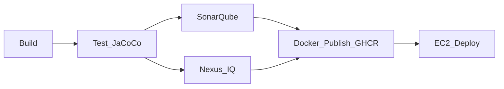

# CI/CD Pipeline — Build → Test → Sonar → Nexus IQ → Docker → Publish → Deploy

Workflow file: [`.github/workflows/ci-cd.yml`](../.github/workflows/ci-cd.yml)



## Stages

| # | Job | What it does |
|---|-----|----------------|
| 1 | **Build** | `mvn compile` on JDK 21 |
| 2 | **Test** | `mvn verify` (Surefire + JaCoCo) |
| 3 | **SonarQube** | Quality gate (`sonar.qualitygate.wait=true`) — skipped if `SONAR_TOKEN` secret missing |
| 4 | **Nexus IQ** | SCA policy eval app id `credit-card-platform` — skipped if `NEXUS_IQ_URL` missing |
| 5 | **Docker + Publish** | Build multi-stage images, push to GHCR (`ghcr.io/<owner>/credit-card-<service>`) |
| 6 | **Deployment** | SCP compose to EC2, SSH `docker compose pull && up -d` on `main`/`master` |

PRs run Build + Test (+ Sonar/IQ if secrets present). Image publish/deploy only on branch pushes (not PRs).

## GitHub Secrets to configure

| Secret | Required for | Example |
|--------|----------------|---------|
| `SONAR_TOKEN` | Sonar | From SonarQube/SonarCloud |
| `SONAR_HOST_URL` | Sonar | `https://sonarcloud.io` or your server |
| `NEXUS_IQ_URL` | Nexus IQ | `https://iq.example.com` |
| `NEXUS_IQ_USER` | Nexus IQ | service account |
| `NEXUS_IQ_PASSWORD` | Nexus IQ | password/token |
| `EC2_HOST` | Deploy | `ec2-xx-xx.compute.amazonaws.com` |
| `EC2_USER` | Deploy | `ec2-user` or `ubuntu` |
| `EC2_SSH_KEY` | Deploy | Private PEM contents |
| `GHCR_USER` | Deploy pull | GitHub username or bot |
| `GHCR_TOKEN` | Deploy pull | PAT with `read:packages` |

`GITHUB_TOKEN` is automatic for pushing to GHCR (job needs `packages: write`).

## One-time EC2 setup

1. Launch Amazon Linux 2023 / Ubuntu EC2, open ports **80**, **8080**, **8086** (or put an ALB in front).
2. SSH in and run:
   ```bash
   curl -fsSL https://raw.githubusercontent.com/<org>/<repo>/main/deploy/ec2/setup-ec2.sh | bash
   ```
   Or copy `deploy/ec2/setup-ec2.sh` and execute it.
3. Create `/opt/credit-card-platform/.env` from [`deploy/ec2/.env.example`](../deploy/ec2/.env.example).
4. Ensure the instance can reach `ghcr.io`.
5. Push to `main` — the **Deployment** job updates the stack.

Manual deploy on the box:

```bash
cd /opt/credit-card-platform
export IMAGE_PREFIX=ghcr.io/<owner>/credit-card
export IMAGE_TAG=latest
docker compose -f docker-compose.prod.yml pull
docker compose -f docker-compose.prod.yml up -d
```

## Manual workflow controls

**Actions → CI-CD → Run workflow**:
- `skip_sonar`
- `skip_nexus_iq`
- `skip_deploy`

## Local quality commands

```bash
mvn -B verify
mvn -B sonar:sonar -Dsonar.host.url=... -Dsonar.token=...
mvn -B package -DskipTests com.sonatype.clm:nexus-iq-maven-plugin:evaluate \
  -Dnexus-iq.serverUrl=... -Dnexus-iq.username=... -Dnexus-iq.password=... \
  -Dnexus-iq.applicationId=credit-card-platform -Dnexus-iq.stage=build
```
