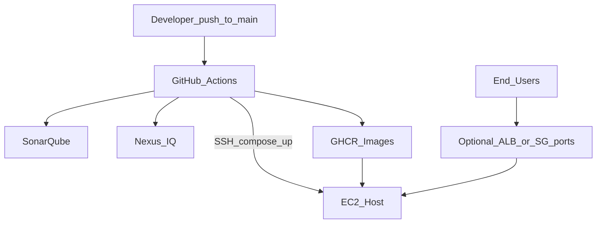
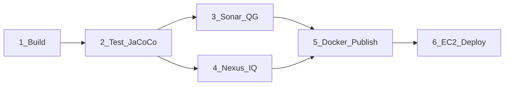
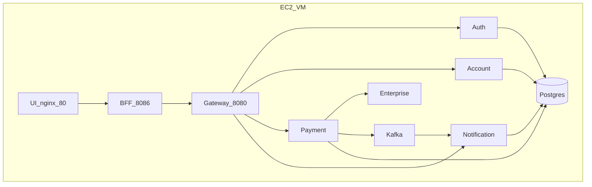

# Deployment Design — Production Path

## Target architecture (EC2 + Docker Compose + GHCR)



## Pipeline stages (fail-fast)



Details and secrets: [CI_CD.md](CI_CD.md)

## Runtime on EC2

Compose file: [`deploy/ec2/docker-compose.prod.yml`](../deploy/ec2/docker-compose.prod.yml)



## Kubernetes path (alternate)

Kustomize bases under `k8s/base` with overlays `dev` / `stage` / `prod`:

- Deployment + Service + ConfigMap + Secret
- HPA + PDB
- Ingress only on gateway (`cards.local`)
- Anti-affinity, probes, non-root securityContext

```bash
kubectl apply -k k8s/overlays/prod
```

## Production controls checklist

| Control | How |
|---------|-----|
| Immutable artifacts | GHCR image tag = git SHA |
| Secrets | GitHub Secrets + EC2 `.env` / K8s Secrets |
| Health | `/actuator/health/liveness` + `readiness` |
| Rollback | `IMAGE_TAG=<previousSha> docker compose up -d` |
| Tenant isolation | Channel/client allow-lists in YAML |
| Auth | OAuth2 JWT + JWKS issuer |
| SCA / quality | Nexus IQ + Sonar quality gate |
| Observability | Structured JSON logs + correlation id |

## Disable seed data in prod

Set `app.seed.enabled=false` (recommended next hardening) or exclude `*DataInitializer` with `@Profile("!prod")` before go-live with real customers.
